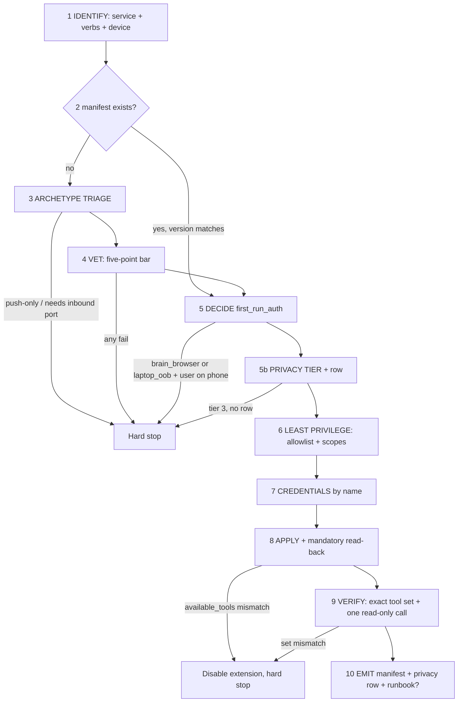

# Connect a service

One generic workflow for wiring the brain to **any** external service. Its output artifact
is a [connector manifest](../../connectors/README.md), so the second connection to a given
service is a lookup instead of a research project.

Read both of these before doing anything irreversible — they are the contract this skill
executes, not background reading:

- [`config/connectors/README.md`](../../connectors/README.md) — the manifest schema and the
  `available_tools` trap.
- [`docs/connecting.md`](../../../docs/connecting.md) — archetypes, `first_run_auth`, the
  privacy gate, and what is deliberately unsupported.

Facts here are pinned to **goose 1.46.0**. If the goose you are talking to is a different
version, stop (see [Hard stops](#hard-stops)).

## The three things that go wrong

Everything else in this file is procedure. These three are why the procedure exists:

1. **`available_tools` fails open.** Spelled `availableTools` it is silently dropped, and a
   dropped allowlist means *every tool allowed*. Always snake_case, always non-empty, never
   omitted, always read back and asserted equal.
2. **OAuth cannot be completed from a phone.** Three independent fatal mechanisms
   ([`docs/connecting.md`](../../../docs/connecting.md#why-oauth-cannot-be-completed-from-a-phone)).
   Announce that *before* phase 1 finishes, not 40 minutes in.
3. **Privacy classification is a gate, not a label applied afterwards.** Raw request bodies
   hit `<state>/logs/llm_request.*.jsonl` on the first call. A tier decided after that call
   has already leaked.

## Inputs

- **Required:** the service, in the user's words. Do not normalize it to a vendor name yet.
- **Required:** which device the user is on **right now** — phone or Mac. Ask if not
  obvious. This is load-bearing at phase 5 and cheap to ask at phase 1.
- Optional: the account/tenant, when the service has more than one of yours.
- Optional: `read_only: true` — the default posture anyway; setting it forbids adding any
  write/send/delete tool to the allowlist even if the user later asks mid-run.

## Prerequisites

- A running `goose serve` on the brain at the pinned version, reachable over the tailnet.
- The ACP custom methods (all present at 1.46.0; verified against `crates/goose/acp-meta.json`
  at the `v1.46.0` tag, the only machine-readable method contract goose publishes):
  `_goose/unstable/extensions/available`, `_goose/unstable/config/extensions/list | add |
  remove | set-enabled`, `_goose/unstable/session/extensions/add`,
  `_goose/unstable/config/upsert`.
- **Driving ACP by hand**, if you are not going through the phone client: `POST /acp`; the
  server assigns a connection id in the `acp-connection-id` response header on `initialize`,
  and every later request must send it back as `Acp-Connection-Id`. Replies to those later
  calls arrive on a separate `GET /acp` SSE channel, not in the POST body. Requires
  `GOOSE_SERVER__SECRET_KEY` unless started `--dangerously-unauthenticated`.
- Write access to this repo's checkout for phase 10. If you have none, you may still connect
  — but say plainly at the end that no manifest was left behind.

## Phase flow



---

## 1 — IDENTIFY

Get **verbs**, not a product name. "Connect Todoist" is not a spec; "read my tasks and add
new ones, never complete or delete" is. The verbs become `capabilities:` in the manifest and
they are what phase 6 turns into an allowlist.

Ask, in one message:

- Which operations do you want the agent to be able to do? Which must it **never** do?
- Which account, if there is more than one?
- Are you on the phone or the Mac right now?

Default posture is **read-only**. A write, send, or delete tool enters the allowlist only if
the user named that verb here. Never widen the allowlist later "while we're in there".

## 2 — MANIFEST LOOKUP

Check `config/connectors/<id>.yaml` for a kebab-case id, then grep `display_name:` and
`summary:` across `config/connectors/*.yaml` for aliases (a user asking for "Gmail" wants
`google-workspace.yaml`).

If a manifest exists, **skip research entirely — phases 3, 4 and 6 do not run.** Three
freshness checks first, and they are not optional:

| Check | If it fails |
|---|---|
| `goose_version_verified` equals the running goose (`goose --version`) | Hard stop — wire shapes are unverified on this version |
| `verified_on` within ~90 days | Re-run bar 1 (maintenance) and re-resolve the pinned server version only; leave the rest |
| `privacy.row_added: true` **and** `<!-- connector: <id> -->` actually present in `docs/privacy.md` | Treat as no row — go to phase 5b. A manifest can lie; the file cannot |

Then jump to phase 5 to apply the device gate against the manifest's recorded
`first_run_auth`, and continue from there. Phases 8 and 9 always run, manifest or not.

## 3 — ARCHETYPE TRIAGE

Pick one of the six from the
[archetype table](../../connectors/README.md#archetypes), in this order of preference —
each step down costs privacy, reliability, or phone-completability:

1. `first_party_remote_mcp` — the provider hosts it. Only two parties, so vetting bar 2 is
   automatic, and if it takes a bearer token it is phone-completable.
2. `self_hosted_mcp_stdio` — a community server on the brain.
3. `standard_protocol_bridge` — IMAP/SMTP/CalDAV, possibly behind a vendor bridge.
4. `local_cli_wrapper` — a good CLI, no MCP server: wrap N fixed invocations as N named tools.
5. `browser_automation` — no API, no export. Last resort.
6. `periodic_export` — no live API. **Mac-only**: the phone client can send only text content
   blocks, so nothing reaches `/data` from a phone.

### Checking for a first-party server is a docs search, not a GitHub search

This is the step most often done badly. Google ships first-party MCP endpoints that a
GitHub-only search misses entirely, and you will then self-host a worse community server for
no reason. Consult, this run, with a live fetch:

- the provider's **developer / API documentation site** (search it for "MCP", "Model Context
  Protocol", "remote server");
- the provider's changelog, release notes, or engineering blog;
- the MCP registry / directory listings;
- GitHub — **last**, and only to identify community servers.

Record the URL you actually fetched. "I believe they have one" is not a finding.

Two archetypes that do not exist, no matter how the service is shaped: `sse` (goose's ACP
layer refuses it — *"SSE is unsupported, migrate to streamable_http"* — and 1.46.0 reports
`mcpCapabilities: { http: true, sse: false }`; use `http`) and `webhook_inbound` (the brain
has zero public inbound ports by design). **A push-only service is a hard stop.**

## 4 — VET

The five-point bar from [`docs/providers.md`](../../../docs/providers.md#the-vetting-bar-what-workspace-mcp-had-to-clear),
applied at adoption time, recorded as manifest `vetting:` data. Every verdict needs evidence
you obtained **this run** — a URL, a version string, a release date.

| # | Bar | Evidence that counts | Fails when |
|---|---|---|---|
| 1 | Maintenance | Latest release tag + date, fetched now; open-issue skim for auth breakage | No release in many months, or a pile of unanswered auth-broken issues |
| 2 | Self-hosted auth, no third party | stdio on the brain, or a first-party remote endpoint. Only you and the provider | Anything proxying your data through a fourth party's service |
| 3 | Relocatable credential/state storage | A documented token/state dir you can point at `/data` (goose's own config/state already move via `GOOSE_PATH_ROOT`) | State hardcoded somewhere on the root disk |
| 4 | Tool surface fits, and is restrictable | Enumerable tool names, plus server-side scope/permission flags | Tool names undiscoverable, or an all-or-nothing credential — record as partial and say so |
| 5 | A privacy row first | A row in `docs/privacy.md` **before** the first call | Phase 5b |

Two rules with no exceptions:

- **Never recommend a server you have not verified exists this run.** Resolve the exact
  package name *and* a specific version from a live registry/repo page. Package names from
  memory are how you end up installing someone else's typosquat.
- **Pin the version in `args`** (`workspace-mcp@1.25.0`, not `workspace-mcp`). A floating tag
  means the tool surface — and therefore your allowlist — can change under you between runs.

## 5 — DECIDE `first_run_auth`

**The single most important behaviour in this skill.** Decide this before writing anything
anywhere, and say the answer out loud in your next message.

| `first_run_auth` | Meaning | Phone |
|---|---|---|
| `none` | No credential at all | Yes |
| `phone_secret` | An API token or app password that can be typed | Yes |
| `brain_browser` | Interactive consent/login on the brain itself (all OAuth) | **No — needs a laptop** |
| `laptop_oob` | Out-of-band setup, then state copied to the brain | **No** |

If it is `brain_browser` or `laptop_oob` **and the user is on a phone**, stop here. Say, in
the first sentence:

> This one can't be finished from your phone. `<service>` needs `<brain_browser reason>`, so
> it takes a session on the Mac (`<runbook path, if one exists>`). Nothing has been changed.

Then stop. Do **not** create the extension, do **not** write the secret, do **not** "start it
and see how far we get". Stranding a half-configured extension with a credential that never
arrives is worse than not starting: a missing `envKey` is a hard extension-startup failure,
so the next session boots with a broken extension and no explanation.

Never attempt goose's OAuth flow from a phone as an experiment. The callback is loopback-bound
on the brain, the authorization URL is emitted only to the brain's stderr and appears in no
ACP message, and URL-mode elicitation is explicitly refused at goose's ACP bridge. There is no
device-code grant in the MCP path (upstream issue #11086). It cannot work; trying just
produces a hung flow.

The phone-native happy path is `phone_secret`. If the service offers *both* OAuth and a
personal API token, take the token — that choice is the whole difference between a
connection the user can finish and one they cannot.

### 5b — PRIVACY TIER AND ROW

Classify by **the most sensitive content the connector can surface**, not by its label. A
files connector is Tier 3 the moment the drive holds a tax return.

Before the first call — not after — confirm a row exists in the **connector data-source
table** ("Connector data sources") of [`docs/privacy.md`](../../../docs/privacy.md). That is
*not* the provider policy summary table above it: that one records where data **goes** and
what the provider may retain, this one records what a connector can pull **in**. A connector
that introduces no new inference route owes no provider-table row, and adding one there
instead of here does not satisfy the gate.

Four columns, and an HTML comment carrying the manifest `id:` — the marker is what
`scripts/verify/check-connectors.sh` greps for, so the row survives a retitled display name:

```
| **<display_name>** <!-- connector: <id> --> | <what it can surface> | <tier> | <route and delivery rule> |
```

- **What it can surface** is concrete: message bodies, event attendees, lab results — the
  content, not the product name.
- **Tier** is the most sensitive content reachable through it, written as `2, routinely
  surfaces 3` when that is the truth. That phrasing is load bearing: it means the sweep that
  reads this connector is pinned as if it were Tier 3.
- **Route and delivery rule** names the models allowed and what may leave in a digest or
  notification (Tier 3: counts and neutral titles only).

Tier 3 with no row is a hard stop. Tier 1–2 with no row: write the row in phase 10 and say
so. Set `privacy.row_added: true` only once the marker is in the file — the validator checks
the marker, not the claim.

## 6 — LEAST PRIVILEGE

Two independent gates. Set **both**; they protect against different things.

| | `available_tools` | Server scopes / permission flags |
|---|---|---|
| Gates | what the *agent* may call | what the *credential* may do |
| Also buys | a smaller tool list on every request | a smaller consent screen |
| Fails when | a stolen token still reads everything | the agent is tightly bound but the token is not |

A tight allowlist over a credential scoped to your whole Drive still means a stolen token
reads your whole Drive. Conversely, tight scopes with no allowlist means every request carries
every tool and the agent can delete on a whim.

**Getting the real tool names**, in order:

1. The server's own docs or source at the version you pinned in phase 4.
2. Failing that, run the server's command directly on the brain, outside goose, and do a
   `tools/list` JSON-RPC handshake against it. Protocol-level, always available, costs nothing.
3. **Never** discover tool names by adding the extension with an empty or absent
   `available_tools` "just to look". That is a live, fully-privileged extension attached to a
   real session.

Then map phase 1's verbs to the minimal set. Include no tool whose name implies a verb the
user did not ask for. Ambiguous name (`manage_*`, `update_*`), unclear from docs? Leave it
out and say you left it out — a missing tool produces a legible failure, an extra one
produces a silent capability.

Server-side, translate the same verbs into that server's flags (workspace-mcp's
`--permissions gmail:send calendar:full tasks:manage` is the worked example). If the server
has no scope mechanism, that is vetting bar 4 partial: record it in `vetting.restrictable_tools`
and in `privacy.notes`, and tell the user the credential is broader than the agent.

### Fields that do not exist at 1.46.0

`clientId`, `clientSecretKey` and `scopes` on the `mcp` variant are **v1.47.0+ only and absent
at the pinned version**. Do not emit them. (The validator's rules about them — `scopes`
requires `clientId`, all three are `http`-only — bite if and when the pin moves.)

## 7 — CREDENTIALS

By **name**, never by value.

1. Declare `envKeys: [SERVICE_TOKEN, ...]` on the extension and keep **`server.env: []`**.
   Inline `env` values cross the ACP frame in plaintext and get promoted into secret storage
   anyway; declaring `envKeys` keeps the value out of the frame entirely. This is also the
   blast-radius control: goose does no `env_clear`, so every stdio child inherits `goose
   serve`'s full environment — per-connector `envKeys` is what keeps connector #1 from
   reading connector #7's credential out of a global env file.
2. The user enters the value in the phone client's **credential field for the connector**,
   which sends `_goose/unstable/config/upsert` with the secret flag set (`isSecret` on the
   wire — camelCase, unlike `available_tools`; confirm the exact spelling against
   `acp-meta.json` at the pinned tag before sending it by hand). goose writes it to
   `<config_dir>/secrets.yaml`, mode 0600 — on the LUKS volume because
   `goose-serve.service` sets `GOOSE_PATH_ROOT=/data/goose`. On a client with no such field,
   the fallback is `goose configure` on the brain over SSH.
3. **Never ask the user to paste a secret into the chat**, and never echo one back. A value in
   the conversation is a value in `sessions.db` and in `llm_request.*.jsonl`.
4. **Never read a secret back to confirm it.** `config/read` with the secret flag returns the
   first `min(len/2, 8)` characters in clear plus the exact length. Confirm by handshake in
   phase 9 instead.

Four footguns worth naming to the user before they type:

- A **numeric-looking app password** (e.g. `12345678`) that lands as a JSON number logs
  *"Secret value is not a string; skipping"* and **the server starts without its credential**.
  Quote it. This one fails open and silent — it is the nastiest of the four.
- A **missing `env_key`** is a hard extension-startup failure. Fails closed, loudly. Good.
- A **missing `${VAR}` in a remote extension's header** is left **literal**, producing a 401
  rather than a startup error. Fails open — which is why phase 9 is mandatory for remote
  extensions specifically.
- `${VAR}` substitution applies **only** to a remote extension's `uri`, `headers` and
  `socket`, never to stdio `env` values, and `cwd` is hardcoded `None` over ACP. So the
  repo's `<PROVIDER>_*` naming convention **cannot** be honoured for stdio connectors: a
  server demanding `MCP_EMAIL_SERVER_PASSWORD` gets exactly that key, and two accounts on the
  same protocol collide on it. Record the collision in the manifest rather than pretending.

## 8 — APPLY

Exact order. No step is optional and none may be reordered.

1. `_goose/unstable/config/upsert` for each secret (phase 7), before the extension exists.
2. `_goose/unstable/config/extensions/add` with the manifest's `acp_extension` payload
   **verbatim** — `available_tools` snake_case, non-empty.
3. `_goose/unstable/session/extensions/add` to attach it to the session you are talking in.
   No restart is needed, and a restart would kill this very conversation.
4. **Mandatory read-back.** `_goose/unstable/config/extensions/list`, find the entry by
   `configKey`, and assert `available_tools` is **present, non-empty, and set-equal to what
   you sent**. Any of the three failing is a hard stop: immediately
   `_goose/unstable/config/extensions/set-enabled` → false (or `config/extensions/remove`),
   tell the user the allowlist did not stick, and stop. Never downgrade this to a warning —
   the failure mode it catches is "every tool is allowed".

Expect the on-disk representation to differ from the wire, and do **not** call that a
mismatch:

| | ACP wire (what you sent) | `config.yaml` (what goose wrote) |
|---|---|---|
| Remote transport | `type: http`, `url` | `type: streamable_http`, `uri` |
| Secret names | `envKeys` | `env_keys` |
| Tool allowlist | `available_tools` | `available_tools` |

## 9 — VERIFY

The handshake that replaces reading a secret back.

1. List the tools the session now exposes for this extension. Assert the set is **exactly**
   `available_tools` — same count, same names. Any extra tool, especially a write/send/delete
   one, is a hard stop: disable and remove.
2. Call **one** cheap, read-only tool and show the user the result. For a remote extension
   this is the only thing that catches an unsubstituted `${VAR}` header, which otherwise
   presents as a plain 401 much later.
3. Record the asserted count as `smoke_test.expect_tools_exactly` in the manifest.

If `scripts/verify/check-connectors.sh` is in your checkout, run both
`scripts/verify/check-connectors.sh --smoke <id>` (the server's real tool surface) and
`scripts/verify/check-connectors.sh --acp-roundtrip <id>` (the phase-8 read-back, executed
against the running `goose serve` instead of by hand). If it is not, the phase-8 read-back and
this assertion still happen by hand — the script is a convenience, not the requirement.

## 10 — EMIT

Three artifacts, then the wrap-up.

1. **`config/connectors/<id>.yaml`**, full schema per
   [`config/connectors/README.md`](../../connectors/README.md#schema). `verified_on` is today.
   `goose_version_verified` is the version you actually observed (`goose --version`), never
   one from memory. `vetting:` carries the evidence strings you collected in phase 4, not
   restatements of the verdict.
2. **The `docs/privacy.md` row** (phase 5b's shape: the connector data-source table, four
   columns, `<!-- connector: <id> -->` marker) if it was not already there. Set
   `privacy.row_added: true` only after the marker is in the file.
3. **A runbook**, `docs/setup/3x-<id>.md`, shaped like
   [`docs/setup/30-google-oauth.md`](../../../docs/setup/30-google-oauth.md) — **required**
   when `first_run_auth` is `brain_browser` or `laptop_oob`, or when there are any
   out-of-band steps (app registration, bridge install, an export job). Point `runbook:` at
   it. Omit the field when the whole thing was `none`/`phone_secret` with no manual setup.

Do not commit silently. The vetting bar is **not self-certifying**: a human confirms bar 1
(maintenance) and bar 2 (self-hosted auth) before the manifest lands. Show the diff and say
which two verdicts need a human eye.

### Wrap-up

Print: service and `<id>`; archetype; `first_run_auth` and `phone_completable`; the exact
allowlist and the server-side scopes; secret key names (never values); the read-back result;
the smoke-test tool count and which tool was called; privacy tier and whether the row is new;
files written; and anything left for the human — the two vetting confirmations, the runbook if
one is needed, and any recorded blocker.

---

## Hard stops

Abort and report. Do not improvise a partial connection around any of these.

| Condition | Why |
|---|---|
| `first_run_auth` is `brain_browser`/`laptop_oob` and the user is on a phone | OAuth is unfinishable from a phone; a half-built extension with a missing `envKey` breaks the next session |
| Any of the five vetting points fails | "Use it anyway with a tight allowlist" does not fix a fourth party holding your mailbox |
| The server cannot be verified to exist **this run** (no live package + version) | Package names from memory are how typosquats get installed |
| Tier 3 content with no `docs/privacy.md` row | Raw bodies hit the LLM request log on the first call; deciding the tier afterwards is deciding it too late |
| Allowlist read-back absent, empty, or unequal | Empty means *all tools allowed*. This is the failure the whole workflow exists to catch |
| Phase 9 tool set ≠ allowlist | Same reason, one layer up |
| Push-only service / requires an inbound webhook | The brain has zero public inbound ports, by design |
| Running goose ≠ `goose_version_verified` / the pin | Every wire shape here, including the snake_case trap, is version-specific |
| A secret would have to travel through the chat to proceed | Secrets never enter the conversation, in either direction |
| The task needs a file sent from the phone | The mobile client sends text content blocks only; `periodic_export` is Mac-only |

## Never

- Never send `availableTools`; never omit `available_tools`; never send it empty.
- Never put values in `server.env`.
- Never use `server.type: sse`.
- Never emit `clientId` / `clientSecretKey` / `scopes` at the pinned 1.46.0 — they do not exist there.
- Never read a secret back to verify it.
- Never widen an allowlist mid-run to make a failing smoke test pass.
- Never mark `privacy.row_added: true` before the row is in the file.
