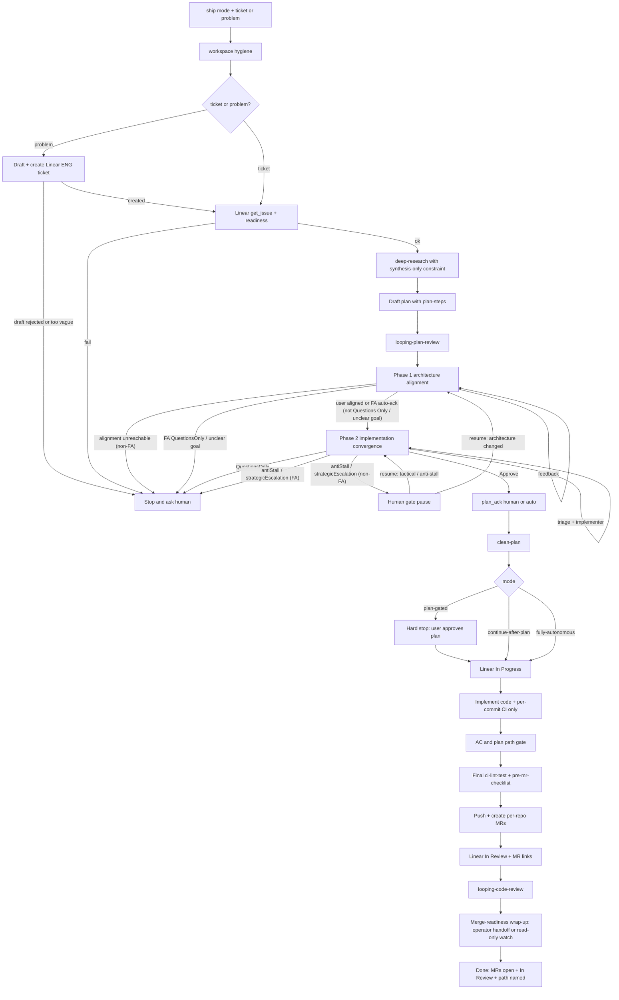

# Ship

Thin phase state machine that takes Linear ENG work from intake (or optional ticket create from a Slack/problem paste) through research, plan, implement, verify, and GitLab MRs. Compose existing skills by **reading and executing** each child `SKILL.md` on the **main agent** — do not copy child SOPs into this file.

## Inputs

- **Required:** mode — `plan-gated` | `continue-after-plan` | `fully-autonomous`. Ask if omitted — no silent default.
- **Required one of:**
  - `ticket` — existing Linear id/URL (`TICKET-1234`), or
  - `problem` — freeform issue text (Slack paste, bug report, etc.) used to **create** a Linear ENG ticket first
- If both `ticket` and `problem` are provided, use `ticket` and skip create-ticket (keep `problem` only as extra research context after redaction).
- If neither is provided, ask which path (existing ticket vs paste a problem).
- Optional: `out_of_scope`; `team` (Linear team name/key, default resolve ENG); `engineer_username` (GitLab username, e.g. `your-username` — resolve early; required before `open_mrs`); reviewer if not inferable.
- Optional `extra_verify`: project-defined verify skills the user explicitly allowlists at invocation; reject names not explicitly provided by the user.
- `skip_phases` forbidden by default for `intake`, `plan_review`, `verify` (and for `create_ticket` on the problem path). Recorded override only. Deny overrides in `continue-after-plan` / `fully-autonomous` unless explicitly overridden in run-state.

## Prerequisites

- Linear MCP
- **Any working GitLab MCP** that exposes `create_merge_request` + `get_merge_request` (enough for ship's `open_mrs`). Prefer zereight `@zereight/mcp-gitlab`, which also covers `mr-review` draft notes and `update_merge_request`. **Do not** use `gh` or GitHub tooling for GitLab MRs.
- Start with workspace hygiene (bootstrap phase): ensure each repo you will change is on a clean default-branch tip (or an agreed base), with no unexpected dirty state
- Resolve `engineer_username` (GitLab username of the initiating engineer) during `bootstrap` or `intake` — do not wait until `open_mrs` (see [MR authorship](#mr-authorship))

## Nesting rule (mandatory)

**Main agent only** reads and executes each child `SKILL.md` — meaning this orchestrator must not wrap a child skill invocation inside a task-tool subagent of its own.

**Allowed (required):** when a child `SKILL.md` itself says to launch subagents (e.g. `looping-plan-review` → `plan-review`'s planner + reviewers + verifier, `deep-research` Tier 2/3 collectors), the **main agent running that child skill** must follow that child SOP fully — including its task-tool fan-out when the task tool is available. Do **not** replace `looping-plan-review`, `plan-review`, or `deep-research` with an abbreviated single-pass self-review.

**If the task tool is unavailable** (nested subagent / toolset without it):

1. **Prefer sequential role-artifact fallback** for `plan-review` (invoked by `looping-plan-review` or standalone): follow the **When the task tool is unavailable** section in [`~/.agents/skills/plan-review/SKILL.md`](../plan-review/SKILL.md) as the single source of truth for the role list and artifact paths. Do **not** hardcode a divergent role list in this file. Record `plan_review_method: sequential_role_artifacts` in run-state. Do not hard-stop merely because the task tool is missing.
2. For `deep-research`, **force Tier 1 synthesis** on this agent when collectors cannot be launched — do not follow deep-research triage into Tier 2/3, and do not invent collector or research-planner results.
3. **Hard-stop** with `last_error: task_tool_unavailable` only when the child SOP cannot be satisfied even via sequential role artifacts (missing required agent files, cannot produce per-role artifacts, or a child requires a non-substitutable subagent type). Tell the user to resume on a main agent that can fan out.
4. **Never** invent a fake Approve / synthesis without the per-role artifacts above.

**Forbidden:** task-wrapping the *orchestrator's call* to `deep-research`, `looping-plan-review`, or `plan-review` (or any child) so a subagent "runs ship phases" or returns a fake gate-passed summary. Nested orchestrator-in-subagent is out of scope for the *parent* wrapping ship; if you *are* that nested agent, still execute this skill with the sequential fallback rather than aborting the whole run early.

**Trusted child skills (only these may be read/executed by this orchestrator):**
`deep-research`, `looping-plan-review`, `plan-review`, `clean-plan`, `ci-lint-test`, `pre-mr-checklist`, `looping-code-review`, plus `extra_verify` allowlist entries above. Reject any other skill name.

## Modes

| Mode | After looping-plan-review Approve | Human approval waits | Stops on |
|------|-----------------------------------|----------------------|----------|
| `plan-gated` | residual ack → clean-plan → **wait for user plan approve** → implement | ticket-draft approve (problem path), Phase 1 alignment gates, plan approve, residual ack, Category A / open questions | impossible-progress + human-gate matrices |
| `continue-after-plan` | residual ack → clean-plan → implement (no plan-approve wait) | ticket-draft approve (problem path), Phase 1 alignment gates, residual ack, Category A / open questions | same |
| `fully-autonomous` | auto `plan_ack` / skippable Category A waivers (`acker: fully-autonomous`) → implement with no human waits | none after bootstrap (auto-creates ticket on problem path; Phase 1 auto-acks only when not Questions Only / unclear goal) | impossible-progress only |

Recommend `plan-gated` for normal work. Other modes opt-in. `fully-autonomous` never auto-merges.

Mode may change at the post-`clean-plan` gate unless `fully-autonomous` already auto-continued.

## Stop matrix

### Impossible-progress stops (all modes)

Hard-stop when any hold:

- Problem path: cannot draft a title + at least one verifiable AC checklist item from the source text
- Intake fails (missing AC checklist, blocked-by, terminal status, oversized ~>6 AC or multi-service epic)
- Plan draft would invent AC beyond the ticket
- Looping-plan-review impossible-progress stops owned by
  [`~/.agents/skills/looping-plan-review/SKILL.md`](../looping-plan-review/SKILL.md): Phase 2
  **Questions Only**; FA Phase 1 **Questions Only** / unclear product goal; FA Phase 2
  **anti-stall** / budget deadlock; FA Phase 2 **STRATEGIC_ESCALATION**. Do not hard-stop
  interactive Phase 1 Questions Only — that path clarifies and re-runs Phase 1. Non-FA Phase 2
  anti-stall stays a human-gate pause (see below). Phase 2 loops tactical fixes until Approve —
  do not stop after a single auto-fix.
- Looping-plan-review Phase 1 alignment unreachable (non-FA: user cannot or will not align)
- Dirty repo needing user at bootstrap
- Linear team cannot be resolved (`list_teams` ambiguous and no `team` input)
- GitLab `engineer_username` cannot be resolved (see [MR authorship](#mr-authorship)) or post-create author is a bot/mismatch
- Unfixable CI / unfixable pre-mr blockers without new requirements
- Blocking Category A (credentials / prior-MR deps that cannot be waived)
- Before merge (never auto-merge)

### Human-gate stops (`plan-gated` / `continue-after-plan` only)

- Problem path: show drafted Linear title+body and wait for explicit create approve (skip wait in `fully-autonomous`)
- Open suggestions → human `plan_ack` before clean/implement
- Clean-plan open questions or waiveable Category A → human complete/waive
- `plan-gated`: explicit cleaned-plan approve
- Research blocking open questions → human answer (`fully-autonomous`: log assumptions in `decisions[]` and continue unless inventing AC beyond ticket)
- Scope mismatch → human decide. `fully-autonomous`: only revert files/commits recorded in this run's `owned_paths` / `owned_commits`; if ownership is unclear, stop (never revert unowned work)
- Looping-plan-review Phase 1 alignment gate each iteration until user says aligned
- Looping-plan-review Phase 2 `STRATEGIC_ESCALATION` (pause for user; do not auto-adopt architecture)
- Looping anti-stall / growth-budget (plan Phase 2 or post-MR code loop) → human decide (`fully-autonomous`: abort loop, keep MRs if any, record `stop_reason`; keep In Review if MRs exist)

## Phase sequence



## Phase enum

Use these exact `phase` values in run-state:

`bootstrap` | `create_ticket` | `intake` | `research` | `plan_draft` | `plan_review` | `residual_ack` | `plan_clean` | `mode_gate` | `linear_in_progress` | `implement` | `scope_gate` | `verify` | `open_mrs` | `linear_in_review` | `looping_review` | `merge_watch` | `done` | `aborted`

## Per-phase contract

For every child-backed phase: **read and execute** the linked `SKILL.md` (or rule) on the main agent, then flush run-state and hand off to the next phase.

| Phase | Skill / tool | Must-read | Continue when | Stop when |
|-------|----------------|-----------|---------------|-----------|
| `bootstrap` | workspace hygiene (fetch/pull default branches; confirm clean trees) | git status / fetch / pull per repo | clean tips recorded | dirty repo needs user |
| `create_ticket` (problem path only) | Linear `list_teams` + `save_issue` (create) | Linear ticket conventions — the `linear-tickets` rule when this project loads it (via project `AGENTS.md` or `opencode.json` `instructions`; template: `config/opencode/project-rules/linear-tickets.md` in personal-ai-setup); otherwise the format in Ticket create below | ticket created; id stored in run-state | too vague to draft AC; team unresolved; create fail; draft not approved (non-autonomous) |
| `intake` | `get_issue` + `list_issue_statuses` | Linear ticket conventions — the `linear-tickets` rule when this project loads it (via project `AGENTS.md` or `opencode.json` `instructions`; template: `config/opencode/project-rules/linear-tickets.md` in personal-ai-setup); otherwise the format in Ticket create below | AC checklist; not blocked-by; not terminal; not oversized | intake gate fails |
| `research` | `deep-research` (main agent) | [`~/.agents/skills/deep-research/SKILL.md`](../deep-research/SKILL.md) | synthesis returned; `fully-autonomous` may continue with logged assumptions | blocking open questions (non-autonomous) |
| `plan_draft` | `.agents/plans/<TICKET>.plan.md` | plan-steps conventions in your global rules (`~/.config/opencode/AGENTS.md`) | plan has plan-steps todos | would invent AC beyond ticket |
| `plan_review` | `looping-plan-review` (main agent; invokes `plan-review`) | [`~/.agents/skills/looping-plan-review/SKILL.md`](../looping-plan-review/SKILL.md) | Phase 2 **Approve** + zero blockers; `phase1_aligned` set | Phase 2 Questions Only; FA Phase 1 Questions Only / unclear goal; FA Phase 2 anti-stall; FA STRATEGIC_ESCALATION; Phase 1 alignment unreachable (non-FA) |
| `residual_ack` | — (orchestrator-native) | run-state | `phase1_aligned` set; no suggestions; human `plan_ack`; or autonomous auto `plan_ack` | `phase1_aligned` missing (re-enter `looping-plan-review` Phase 1); suggestions without ack (non-autonomous) |
| `plan_clean` | `clean-plan` | [`~/.agents/skills/clean-plan/SKILL.md`](../clean-plan/SKILL.md) | cleaned; Category A resolved | blocking Category A / unanswerable open questions |
| `mode_gate` | — (orchestrator-native) | run-state | per Modes table | waiting on user (non-autonomous) |
| `linear_in_progress` | `save_issue` | — | status set + logged | status resolve fail |
| `implement` | cleaned plan code steps only | plan file; per-commit [`~/.agents/skills/ci-lint-test/SKILL.md`](../ci-lint-test/SKILL.md) | code commits green; after each owned commit append paths to `owned_paths` and SHAs to `owned_commits`; plan's final verify/pre-mr/push-mr todos **not** run here | blocking Category A; unfixable CI |
| `scope_gate` | — (orchestrator-native) | plan + AC | matches plan/AC/`out_of_scope` | mismatch / AC unmet |
| `verify` | final `ci-lint-test` + `pre-mr-checklist` + any `extra_verify` allowlist entries from inputs | [`~/.agents/skills/ci-lint-test/SKILL.md`](../ci-lint-test/SKILL.md), [`~/.agents/skills/pre-mr-checklist/SKILL.md`](../pre-mr-checklist/SKILL.md), plus any user-allowlisted `extra_verify` skills| blockers fixed; `extra_verify` results recorded in run-state | pre-mr or `extra_verify` blockers remain |
| `open_mrs` | `git push` + GitLab MCP `create_merge_request` | merge-request conventions in your global rules (`~/.config/opencode/AGENTS.md`), configure a GitLab MCP exposing `create_merge_request` + `get_merge_request` | `engineer_username` already in run-state; push each source branch first; create as **draft** (see [MR authorship](#mr-authorship)); assign initiating engineer when known; target each repo's **default branch** (resolve via remote HEAD / project default — do not assume every repo uses `main`) unless stacking target is in `decisions[]`; idempotency via structured `mr_records`; on existing match re-check draft/author before skip | identity unresolved / post-create bot or author mismatch / create fail / push fail |
| `linear_in_review` | `save_issue` + links | — | status + MR links set | status resolve fail |
| `looping_review` | `looping-code-review` | [`~/.agents/skills/looping-code-review/SKILL.md`](../looping-code-review/SKILL.md) | zero true blockers | anti-stall / budget |
| `merge_watch` | — (orchestrator-native) | merge-request conventions in your global rules (`~/.config/opencode/AGENTS.md`) | `merge_watch_path` recorded; autonomous picks without asking | — |

### Implement vs verify / open_mrs (no duplicates)

`implement` executes the cleaned plan's **code and per-commit CI** only. It must **not** run the plan's final `ci-lint-test`, `pre-mr-checklist`, push, or `create_merge_request` todos — those belong to `verify` and `open_mrs`. If a cleaned plan's wording bundles them, treat those steps as deferred to this skill's later phases. During implement, record every path touched by this run in `owned_paths` and every commit SHA created by this run in `owned_commits` (required for fully-autonomous scope-mismatch reverts). On resume, if `mr_records` / `mr_urls` already has a match, re-fetch the MR and confirm draft + author before skipping create — do not skip a non-draft/mismatch.

### Research constraint (not a deep-research mode flag)

There is no `research-only` flag in `deep-research`. When invoking it from this skill, pass an explicit constraint in the prompt: synthesis only; no code edits; no implementation. If Tier 3 runs `research-planner`, treat that output as research synthesis only — **never** as `.agents/plans/<TICKET>.plan.md`.

### Create-ticket details (problem path)

1. Redact the problem source before any external write: strip secrets, tokens, private URLs, and unnecessary PII. Draft ENG issue from the **redacted** text per the Linear ticket conventions (`## Description`, `## Acceptance Criteria` checklist, `## Resources`, `## Notes`; Resources/Notes may be `None`). Put a short redacted quote in Description or Resources — not the raw paste.
2. Compute `source_hash` (hash of redacted source + title) into run-state **before** create. On resume, if `ticket_created` / `ticket_identifier` / `ticket_url` is set, skip create. If not set, search Linear for an existing issue with the same title or a Notes/`source_hash:` line before calling `save_issue`.
3. Resolve team: use `team` input if given; else `list_teams` and pick the ENG/Engineering team. If multiple matches or none, stop and ask (including `fully-autonomous`).
4. `plan-gated` / `continue-after-plan`: show draft title+body; wait for explicit "create it" before calling Linear. `fully-autonomous`: create immediately after draft.
5. Create with Linear `save_issue` **without** `id` (`title` + `team` required). Assign to initiating engineer when known. Put `source_hash: <hash>` in the ticket **Notes** (or Resources) so lost run-state can still dedupe. Immediately flush `ticket_created`, `ticket_identifier`, `ticket_url`, and `source_hash` to run-state (atomic with the create success path).
6. Proceed to Intake via `get_issue` on the new id.

### Linear status rules (post-create / post-intake)

- Resolve status IDs via `list_issue_statuses` (log IDs in run-state). Do not hardcode names beyond examples.
- Ticket confirm before first **status** write for `plan-gated` / `continue-after-plan` (create-ticket draft approve already covered creation). For `fully-autonomous`, invoke ticket or just-created ticket counts as confirm.
- Set **In Progress** when implement starts (before first code edit).
- Set **In Review** + MR links only after MRs exist.
- Never set **Done**.
- Abort: leave status unchanged; never set In Review.
- Only transition when current ≠ target; log `{from_id,to_id,at}`.

### MR authorship

Do not rely on the GitLab MCP's `whoami` (when present it returns the **token** identity, often a bot). **Never hard-stop for missing `whoami`.** Resolve identity early and verify after create.

**Resolve `engineer_username` (during `bootstrap` / `intake`, before implement):**

1. Explicit input (e.g. `engineer_username=your-username`) — prefer this.
2. Else derive from the local git identity (`git config user.name` / `user.email`), then map to a GitLab username:
   - Prefer GitLab MCP `search` with `scope=users`. Search the **display name** first (e.g. `Phillip Chaffee`), then an exact known username. Do **not** search only the email local-part (`phillip`) — GitLab returns many unrelated `phillip*` users.
   - Confirm the match: returned `name` should equal the git display name (or email matches when present). If **multiple** hits share that display name, do not guess — ask. Persist the chosen `username`.
3. Else ask the user (all modes except `fully-autonomous`).
4. `fully-autonomous` with no resolvable username → hard-stop with `last_error: engineer_username_unresolved` (do not implement hoping identity appears later).

Persist `engineer_username` in run-state as soon as known.

**Create path:**

1. Do **not** treat bot `git` / remote / `PERSONAL_ACCESS_TOKEN` identity as proof that MCP creates will be bot-authored. Push credentials are often a project bot while the GitLab MCP token still creates as the engineer. Prefer MCP `create_merge_request` once `engineer_username` is set, then verify.
2. Check the **live** GitLab MCP tool schemas before calling (list the MCP's tools — do not guess arg names):
   - Some minimal GitLab MCPs take a project arg named `id` (path or numeric) and expose **no** `draft` boolean.
   - Zereight `@zereight/mcp-gitlab`: project arg is often `project_id`; may support `draft: true` and `update_merge_request`.
3. Push each source branch before create.
4. Default create as **draft** unless `decisions[]` records explicit non-draft:
   - If the tool has a `draft` boolean, set it `true`.
   - If not, prefix the title with `Draft: ` (e.g. `Draft: TICKET-1234: …`) so GitLab marks WIP/draft.
5. After create, `get_merge_request` and verify `author.username` matches `engineer_username`. On bot/mismatch: stop, record the MR URL in `last_error`, and do not open further MRs.
6. Draft confirmation after create:
   - If response has `draft` / `work_in_progress`, require it true (unless non-draft was decided).
   - If those fields are absent (common on minimal GitLab MCPs), treat a `Draft: ` title prefix as sufficient — **do not hard-stop** solely because the boolean is missing. If `update_merge_request` exists and the MR is clearly non-draft without a `Draft:` title, fix it; otherwise record a warning in run-state and continue only when title-prefix draft was used.
7. If create fails or author cannot be verified as the engineer, stop (do not keep iterating creates).
8. Default `target_branch` is that repo's default branch (often `main`; some repos may use `master` or other — resolve per project). Only override when stacking is recorded in run-state `decisions[]` (not elsewhere).
9. Assign the initiating engineer when the create API supports `assignee_ids`; missing assignee is a warning in run-state, not a hard-stop.
10. Append a structured `mr_records[]` entry `{repo, source_branch, target_branch, ticket, url, draft, author}` and mirror the URL into `mr_urls`.

### Merge-readiness wrap-up (`merge_watch`)

There is no external autopilot handoff in this setup — **keeping each MR merge-ready is the engineer's job** after this skill wraps up, per the merge-request conventions in your global rules (`~/.config/opencode/AGENTS.md`). Ordered path only:

1. If the user explicitly asks for ongoing monitoring, run a **read-only GitLab MCP watch**: periodically re-fetch MR status, pipelines, and discussions and report — never merge, never publish review responses, never push fixes outside a new ship/implement cycle.
2. Else **operator handoff**: hand back with a concrete merge-readiness checklist — respond to review threads, keep pipelines green, rebase when the target branch moves, and flip off `Draft:` only when ready — per the merge-request conventions.

Wrap-up must state which path ran. Path (1) must **not** claim merge-ready or full autopilot-style coverage. In `fully-autonomous`, pick the path without asking (default: operator handoff).

### Happy-path done

Per-repo MRs open; Linear `In Review` with MR links; run-state complete; `merge_watch_path` named. **Not** merged.

## Durable run state

**Path:** `.agents/plans/<TICKET>.run.md` at the **workspace root** (create `.agents/plans/` if missing). Before ticket id exists, use a **unique** placeholder `.agents/plans/PENDING-<run_id>.run.md` (e.g. short UUID or timestamp), then rename/move to `<TICKET>.run.md`. Never share a single `PENDING.run.md` across concurrent runs.

**Branching for run-state:** per-repo feature branches from `plan-steps` do **not** carry workspace-root `.agents/plans/`. For cross-session resume, commit + push run-state on a **workspace-root** branch (the ship working branch, e.g. `username/<ticket>-ship`), not on the feature branches of each service repo.

**Resume contract:**

- **Guaranteed:** same conversation / same surviving workspace only
- **Cross-session / new machine:** after the workspace tracking branch exists, commit + push run-state on **every** flush (including phase-only transitions). On a new agent, user must point at branch **and** run-state path or ticket id. Before that branch exists, post a Linear comment checkpoint (`phase`, mode, plan path, `source_hash`). **Do not** claim an uncommitted run file survives a fresh checkout or machine
- On resume: require `continue ship --run .agents/plans/<TICKET_OR_PENDING>.run.md from phase <phase>` (or ticket id that resolves to that file). Pre-ticket resumes use the `PENDING-<run_id>.run.md` path. Skip completed phases; never re-create Linear tickets if `ticket_created` / matching `source_hash`; never re-create MRs already in `mr_records`/`mr_urls` without re-checking draft+author; never re-apply Linear transitions already logged
- If resuming at `verify` or `open_mrs` with per-repo feature branches but incomplete verification, **rerun `verify`** before `open_mrs`. Only repair MR create after verify has a successful result recorded for this tip

**Flush:** after every phase transition, every commit, every Linear/MR mutation, and on abort. Once the workspace tracking branch exists, each flush is committed and pushed.

**Skeleton:**

```markdown
# ENG-XXXX run
mode: plan-gated | continue-after-plan | fully-autonomous
phase: <phase enum>
source: ticket | problem
source_hash: null | "..."
problem_excerpt_redacted: null | "..."
ticket_created: false
ticket_identifier: null | "ENG-XXXX"
ticket_url: ...
engineer_username: null | "your-username"
plan_path: ...
plan_review_verdict: Approve | ...
phase1_aligned: null | { at, acker }  # acker: user | fully-autonomous
looping_plan_iterations: { phase1: 0, phase2: 0 }
plan_baseline_lines: null | <int>
plan_ack: null | { suggestion_ids, acker, at }
category_a_waivers: []
decisions: []
auto_fix_cycles: 0  # legacy; plan review uses looping_plan_iterations instead
owned_paths: []
owned_commits: []
mr_urls: []
mr_records: []  # {repo, source_branch, target_branch, ticket, url, draft, author}
extra_verify_results: []
merge_watch_path: operator_handoff | gitlab_watch_readonly | skipped | legacy

**Legacy resume normalization.** If an older run-state uses `babysit_opt` /
`babysit_path` or `autopilot_opt` / `autopilot_path`, map them to `merge_watch` /
`merge_watch_path` before continuing. Treat a completed legacy path as already
done (`merge_watch_path` = `legacy`); do not re-run automation. An incomplete
legacy path enters `merge_watch` with the same rules as a fresh wrap-up.
linear_status_writes: []
stop_reason: null
last_error: null
resume: continue ship --run .agents/plans/<TICKET_OR_PENDING>.run.md from phase <phase>
```

**Abort runbook:** set `phase: aborted` + `stop_reason`; list branch/MR leftovers in run-state; leave Linear unchanged (do not delete a ticket this skill created); tell operator to close or keep MRs/branches manually; do not set `In Review`.

## Hard out-of-scope

- No auto-merge / deploy
- No inventing AC beyond the ticket (create path drafts AC from redacted source — that is allowed)
- No pointer/meta commits across repos unless asked
- No launch-check
- No autopilot-style merge automation — post-wrap-up MR upkeep belongs to the engineer (see merge-readiness wrap-up)
- No deleting Linear tickets on abort
- No executing child skills outside the trusted allowlist

## Wrap-up

Print: ticket (and whether created this run), mode, plan path, run-state path, MR URLs, Linear status, `merge_watch_path`, remaining human steps (merge, Done).
